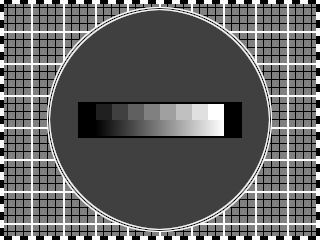
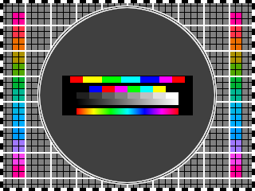

# Public-domain test cards

These are some test cards I created for the purpose of providing some
good-quality reference images for SSTV development at the resolutions
used by SSTV modes.  They are loosely based on ideas seen in the famous (but
copyrighted) BBC Test Card F, and the Philips PM-5544 test signal generator
(which is intended for PAL resolution).

The following features are present on all test cards:

- Alternating black/white border around the perimeter of the image: 4px
  wide.
- Minor 1px black grid on a 8x8px spacing
- Major 2px white grid on a 32x32px spacing
- Large 1:1 circle for aspect ratio correction
- Discrete black-to-white gradient with levels chosen to approximately
  select tones on 100Hz boundaries in monochrome modes.
- Continuous black-to-white gradient

Colour modes add:

- Colour patches on the background grid selected to match the luminance
  of the background image
- Top discrete colour gradient: HSV full saturation gradient at 3 bit
  colour
- Lower discrete colour gradient: RGB full-saturation colours arranged
  in increasing luminance order
- Bottom continuous colour gradient: HSV full saturation gradient

The resolutions are chosen to correspond to the different SSTV modes
implemented: either supplying your own 16px header, or using that space
for a test pattern:

- `mono-160x120`: for R8BW and R12BW
- `mono-320x240`: for R24BW
- `colour-320x240`: for R24, R36, R72; bring your own header for 320x256
  modes.
- `colour-320x256`: most SSTV modes
- `colour-512x384`: PD-160 mode - bring your own header
- `colour-512x400`: PD-160 mode
- `colour-640x480`: PD-120, PD-180, PD-240 and Pasokon modes - BYO header
- `colour-640x496`: PD-120, PD-180, PD-240 and Pasokon modes
- `colour-800x600`: PD-290 - BYO header
- `colour-800x616`: PD-290

Two formats are provided: `png` for direct use, and `xcf` for editing in The
Gimp and compatible software.

## Future ideas

I would like to include some photos of some people in this.  BBC's Test Card F
included the photo of a young girl playing naughts and crosses with a doll,
which helped calibrate skin tone.

The idea here is a good one, *BUT* there's more than just one skin tone, there
are many, from extremely dark (certain African ethnic groups) through to
extremely pale (parts of UK/Europe).  A *good* test pattern would include a
few, so that good calibration can be achieved for *all* skin tones (or as many
as technically possible).

The thinking being a selection of different photos could be arranged below the
gradient for this purpose.
